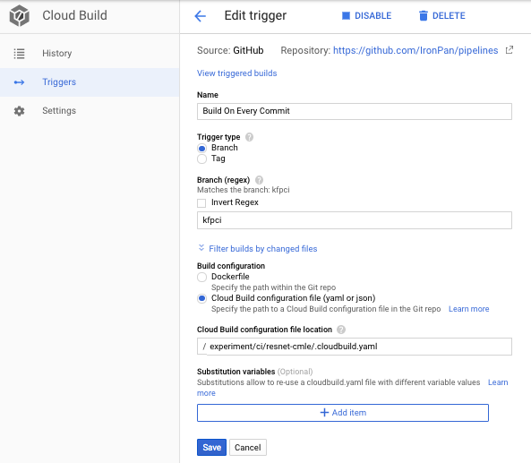

# Continuous Integration For Kubeflow Pipelines
In this sample we would setup a Continuous Integration environment for developing a Kubeflow Pipeline, using [Google Cloud Build](https://cloud.google.com/cloud-build/)

The pipeline consists of two steps
- preprocess using [Cloud Dataflow](https://cloud.google.com/dataflow/). The source code locates in [preprocess/](preprocess)
- training using [Cloud ML Engine](https://cloud.google.com/ml-engine/). The source code locates in [train/](train)

## Setup
- Fork the code to your own git repo.
- Go to your [cloud build](https://pantheon.corp.google.com/cloud-build) page, and set up cloud build to point to the [.cloudbuild.yaml](.cloudbuild.yaml).

- Edit the code, and the cloud build would trigger a new job. The job will package the new code to the GCS bucket in the same project.
